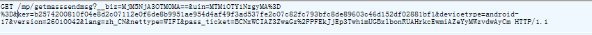
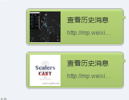
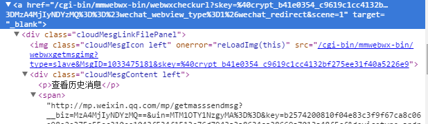
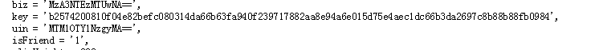
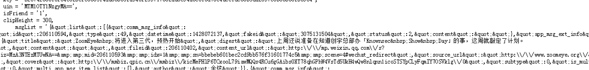
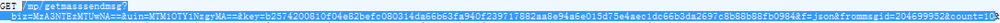

#### 微信公众号抓取思路
微信公众号存在不少精彩的文章，如果善于挖掘，可以得到不少的收获。但由于微信对PC端的支持并不友好，虽然有搜狗搜索可以用，但其结果仍然不全，一些公众号发的不是文章类型的只是一段话，搜狗就不收录。想要得到一个账号所有的文章，还是要从爬虫着手。网上对于微信公众号文章爬取的方法几乎没有介绍，不过有几个网站，比如传送门就做出来了。这就告诉我们这个目标是可以达到的。废话不多说，直入主题。
要想得到一个公众号发送的所有文章，需要从微信手机端入手。点击公众号右上角小人图标，会有查看历史消息的链接。点了之后可查看所有历史文章。所以自然要从这里入手了。上抓包工具，Fiddler4，手机和电脑接入同一网络，手机wlan设置代理，指向电脑的ip地址，端口默认8888，这样在电脑上就可以监听手机的http流量了。通过抓包，在点击‘查看历史消息’选项时，请求的地址是

通过对多个账号进行抓包分析，可以确定biz这个14位的字符串是每个公众号的“id”，uin似乎与访问者有关，key也和所访问的公众号有关，可以在下面的抓取中得到这两个参数，其他的查询参数都可以去掉。
所以，必须得到三个参数才可以得到文章列表。这三个参数biz最容易获得，在[搜狗的微信平台](http://weixin.sogou.com/),搜索目标公众号，会有对应的文章列表，连接到相应的文章页面。解析文章列表，即可得到公共账号的biz。可以通过请求`http://weixin.sogou.com/weixin?query=`,填入目标账号名称，返回的结果里解析最新文章的url，里面包含biz。当然，模糊搜索会出现多个候选账号，这个就比较难办了。
现在，已知biz，如何继续？我曾经也困扰了好久，也算是偶然发现的。电脑登陆微信，在手机上访问某个公众号的查看历史消息页面，点击右上角，发送给朋友，发送给文件助手即可，电脑上查看。

似乎看到连接了，打开，果然跳转到了文章列表的页面！查看元素，这个存在`span`标签内，仔细观察，才发现坑爹啊，和刚才抓包看到的url是一样的！继续寻找，这个`span`是`a`标签的子元素,看这个`a`标签的`href`，
加上`https://wx.qq.com`的前缀，就可以访问了，最后301跳转到了span的内容那个url。多看几个不同的公众号，可以发现`a`标签的内容基本一样，不同的只是biz而已。所以可以把这个url记为raw_url，每次请求时，用不同的biz替换即可。当然，要带上ua，cookie的header。用`request.get(url,headers=m_header,verify=False)`，因为请求的是https域，所以要加上`verify=False`,返回的内容文章列表的那个页面。分析那个页面，即可以找到uin，key，

可以用正则表达式提取出来。紧接着下面就是这个页面的msgList，类似json的文本，当前页面就是通过这里的文本渲染的。

可以用正则提取出来直接解析出来，然后用`json.loads`方法就可以得到dict，里面的信息包括`content_url`，文章发表的`datetime`时间戳，摘要信息，文章的id编号`mid`，还有是否是一次发多篇`is_multi`等。
鼠标向下滚动，可以看到动态请求更久远的文章，抓包可得，是通过json返回的。请求的url就是类似

这种的，前面获取的参数就都派上用场了。只要这几个参数就可以抓取了，后面几个参数不要也可以。要获得一个公众号的全部文章，可以将frommsgid改到比他最新文章的id大一点的数字（实验证明若刚好取最新文章的id，则会忽略最新的那篇），count值设置大一点，比如5000，基本上就会把所有文章信息都返回了。
根据返回的json，从中解析出文章的url，然后就可以去爬取文章了，这个比较常规，貌似连cookie都不用带，就不赘述了。

接下来再说说获取文章点赞数，阅读数的思路。从电脑网页访问是得不到这些数据的，只能从手机上获得。需要的参数还是uin，biz，key，mid以及idx。其中idx是这篇文章所在的编号，比如一个人一天发了3篇文章，idx就分别对应1,2,3。这几个参数的名称可能有些不一样，有时叫mid，有时是appmsgid，是从这样的url里获得的`http://mp.weixin.qq.com/s?__biz=MzA3NTEzMTUwNA==&mid=206110593&idx=1&sn=bbebeb601bec2cd9bb576f31601774c5&scene=4#wechat_redirect`,可能要进行一些异常处理。提交的地址是`http://mp.weixin.qq.com/mp/getappmsgext`，参数是上面提到的，提交的header要伪装成手机的，主要是ua,host要不要用我忘记了，之前的代码里是注释掉这句的,
`readnum_header={'User-Agent':'Mozilla/5.0 (Linux; Android 4.4.2; sdk Build/KK) AppleWebKit/537.36 (KHTML, like Gecko) Version/4.0 Chrome/30.0.0.0 Mobile Safari/537.36 MicroMessenger/6.0.0.61_r920612.501 NetType/epc.tmobile.com',#'Host':'mp.weixin.qq.com'}`，然后返回的还是json，进行解析即可。

以上即是爬取的大致思路。